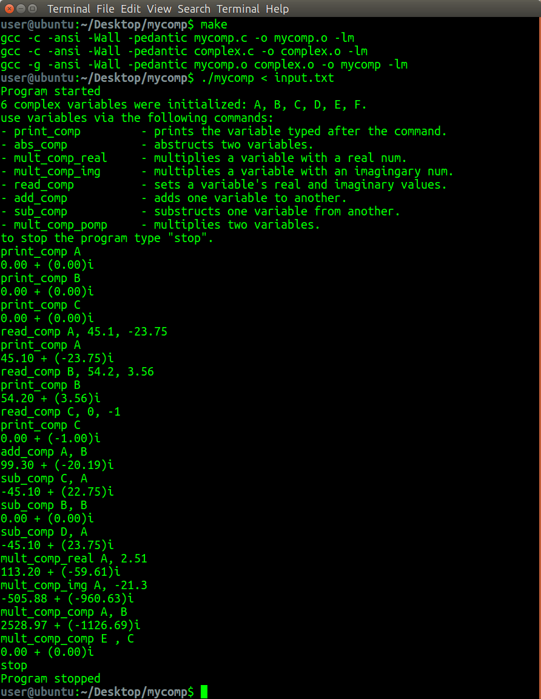
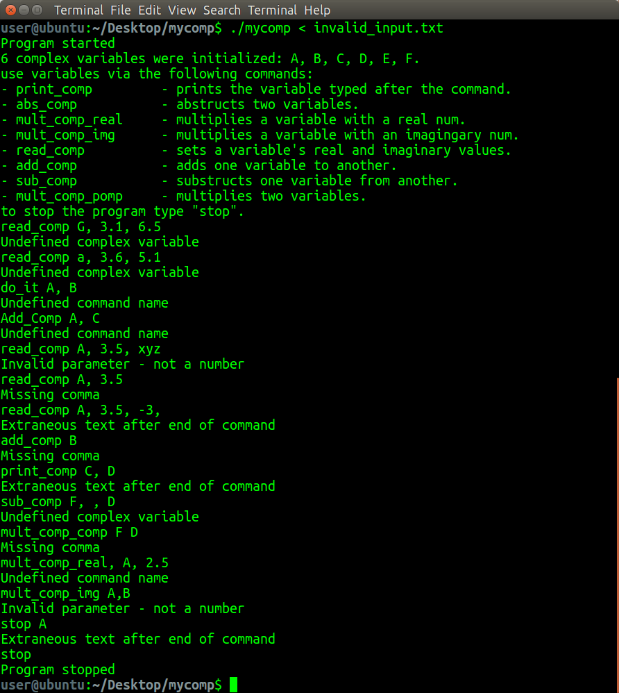

# ComplexCalculatorC 🧮

ComplexCalculatorC is a C program that allows you to perform complex number calculations and explore mathematical concepts in the C programming language. It provides a set of commands to work with complex numbers, making it a useful tool for mathematical calculations and experimentation.

This program was created as a homework assignment for the _System programming Laboratory course (20465)_ at the Open University of Israel, and earned a score of `98`.


## Features ✨

- **Complex Number Operations:** ComplexCalculatorC supports various complex number operations, including addition, subtraction, multiplication, absolute value calculations, and more.

- **User-Friendly Interface:** The program offers a user-friendly command-line interface, making it easy to input complex numbers and perform calculations.

- **Multiple Variables:** You can work with up to six complex variables (A, B, C, D, E, F) simultaneously, allowing for complex calculations involving multiple variables.

## Usage 🚀

1. **Building the Program:**

   To compile the program, use the following command:

   ```bash
   make
    ```

## Commands ✍️

ComplexCalculatorC supports a variety of commands for complex number operations, enhancing mathematical exploration:

| Command           | Syntax                                           | Description |
|-------------------|--------------------------------------------------|-------------|
| `print_comp`      | `print_comp <variable>`                          | Prints the specified complex variable. |
| `abs_comp`        | `abs_comp <variable>`                            | Calculates and displays the absolute value of a complex variable. |
| `mult_comp_real`  | `mult_comp_real <variable>, <real_number>`        | Multiplies a complex variable by a real number and displays the result. |
| `mult_comp_img`   | `mult_comp_img <variable>, <imaginary_number>`    | Multiplies a complex variable by an imaginary number. |
| `read_comp`       | `read_comp <variable>, <real_part>, <imaginary_part>` | Assigns real and imaginary parts to a complex variable. |
| `add_comp`        | `add_comp <variable1>, <variable2>`              | Adds two complex variables and prints the outcome. |
| `sub_comp`        | `sub_comp <variable1>, <variable2>`              | Subtracts the second complex variable from the first and displays the result. |
| `mult_comp_comp`  | `mult_comp_comp <variable1>, <variable2>`        | Multiplies two complex variables and presents the result. |
| `stop`            | `stop`                                          | Exits the program. |

Each command is designed to be intuitive and user-friendly, catering to both beginners and experienced users interested in complex number computations.

## Testing 🧪

To facilitate testing of ComplexCalculatorC, two text files are provided:

- [input.txt](input.txt): Contains a series of valid inputs for testing various functionalities of the program. You can use these inputs to see how the program handles typical use cases.

    
    _Example of valid inputs in `input.txt`_

- [invalid_input.txt](invalid_input.txt): Includes examples of invalid inputs to test the program's error handling and robustness. This can help ensure that the program gracefully handles unexpected or incorrect user input.

    
    _Example of invalid inputs in `invalid_input.txt`_

Feel free to use these files to experiment with the program and understand its capabilities and limitations.

## Contributing 🤝

Contributions to ComplexCalculatorC are welcome! If you have suggestions for improvement or have identified issues, please feel free to open an issue or submit a pull request on the [GitHub repository](https://github.com/Dor-sketch/ComplexCalculatorC).

## License 📜

This project is licensed under the MIT License - see the [LICENSE](LICENSE) file for details.

🚀 Happy Exploring in the World of Complex Numbers! 🧮
