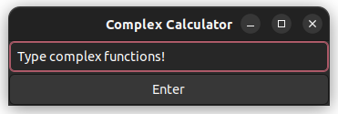
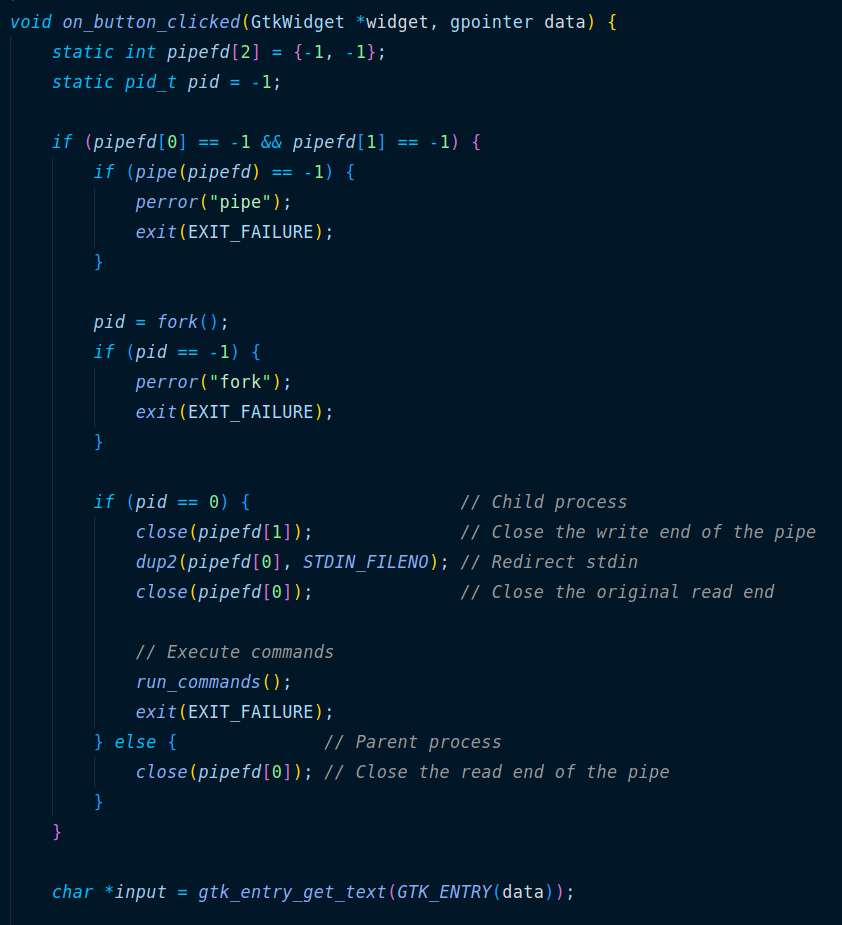
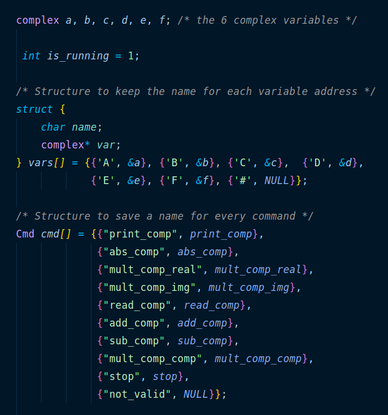
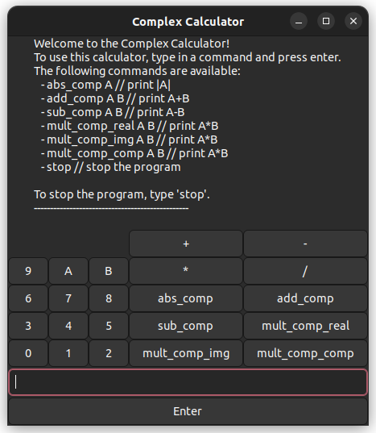
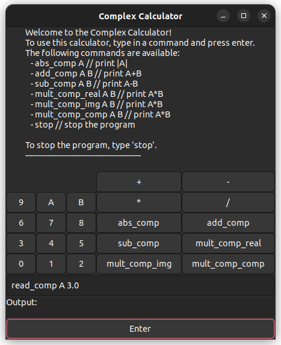
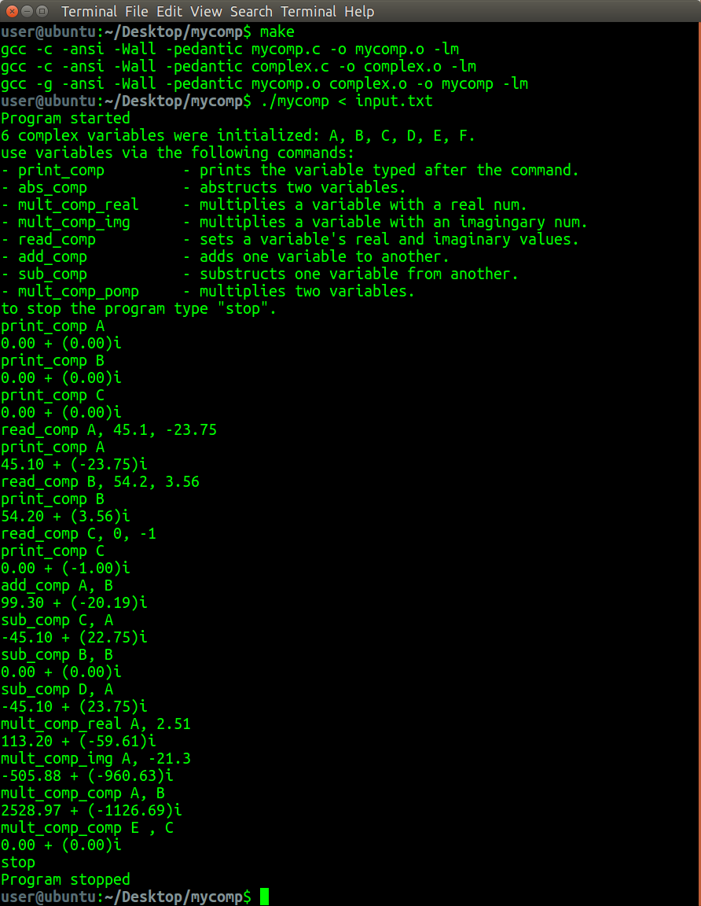
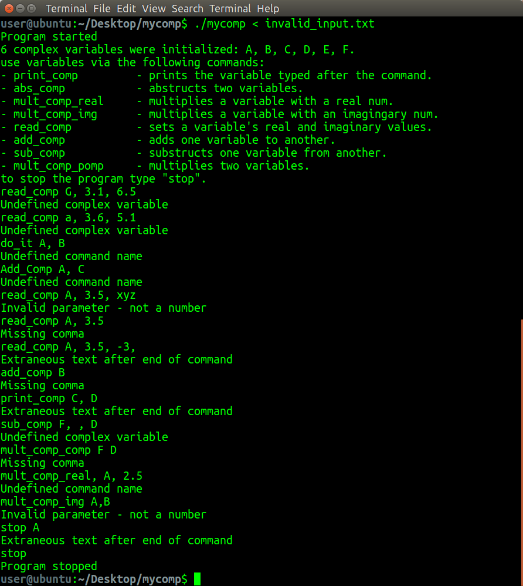
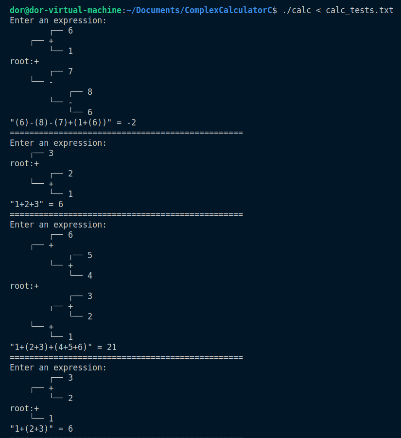
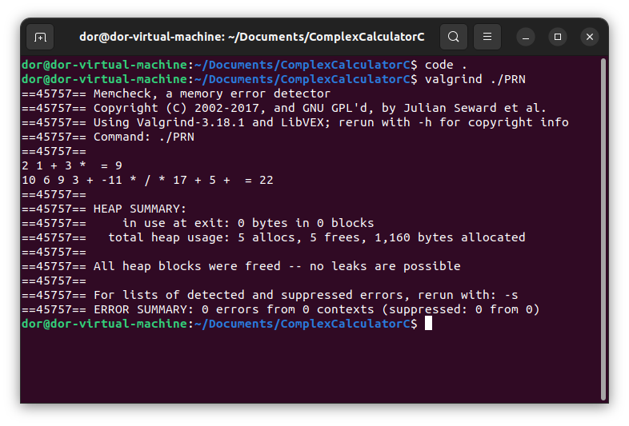

# Complex Calculator C 🧮

This C program revolutionizes mathematical computations by interpreting strings, offering a seamless and intuitive experience for complex number operations. Ideal for both educational and professional use, it's demonstrate C programming concepts such as pointers, structs, and dynamic memory allocation.

This program was created as a homework assignment for the _System programming Laboratory course (20465)_ at the Open University of Israel, and earned a score of `98`.

<p align="center">
  
</p>
<div align="center"><i>Complex Calculator C GUI</i>
</div>

---

### Table of Contents 📋

<!-- @import "[TOC]" {cmd="toc" depthFrom=2 depthTo=2 orderedList=false} -->

<!-- code_chunk_output -->

- [Features ✨](#features-)
- [Usage 🚀](#usage-)
- [New GUI! 🖥️](#new-gui-️)
- [Commands ✍️](#commands-️)
- [Testing 🧪](#testing-)
- [New: Expression Parser and Evaluator 🧮](#new-expression-parser-and-evaluator-)
- [New: Reversed Polish Calculator 🧮](#new-reversed-polish-calculator-)
- [Contributing 🤝](#contributing-)
- [License 📜](#license-)

<!-- /code_chunk_output -->

---

_**Update**: This repository now includes a new expression parser and evaluator written in C: [calc.c](calc.c). This program parses mathematical expressions and evaluates them using an expression tree. It can be used as a standalone program or as a library for other projects. See the [Expression Parser and Evaluator](#new-expression-parser-and-evaluator-) section for more details._

_**Update2**: A new reversed polish calculator features dynamic stack allocation was added to the repository [PRN.c](PRN.c). See the [Reversed Polish Calculator](#new-reversed-polish-calculator-) section for more details._

## Features ✨

- **Advanced Pipeline & Multi-Threading** 🚀: Seamlessly manage inputs/outputs with ComplexCalculatorC's cutting-edge pipeline. Perfect as a standalone calculator or as a part of other projects, it's boosted by multi-threading for speedy calculations. Enjoy easy inputs and calculations with a straightforward command-line interface, designed for all user levels and adaptable to any other project by the STDIN/STDOUT pipeline: the functions have no idea that the input is redirected!

<div>
<p align="center">
  
</p>
<div align="center"><i>ComplexCalculatorC Pipeline</i>
</div>

---

- **Complex Number Operations** 🔢: Tackle everything from simple additions to absolute value calculations with ease, thanks to a wide range of supported complex number operations. Includes Multiple Variable Support: Handle up to six complex variables (A-F) simultaneously, ideal for intricate, multi-variable mathematical tasks.

<div>
<p align="center">
  
</p>
<div align="center"><i>Complex Number Operations</i>
</div>

---

## Usage 🚀

1. **Building the Program:**

   To compile the program, use the following command:

   ```bash
   make
    ```

## New GUI! 🖥️

ComplexCalculatorC now includes a graphical user interface (GUI) for a more intuitive user experience. The GUI is built using the `Gtk+` library and allows you to perform complex number calculations and explore mathematical concepts in a visual environment.

|  |  |
| :-----------------------------: | :-----------------------------: |

## Commands ✍️

ComplexCalculatorC supports a variety of commands for complex number operations, enhancing mathematical exploration:

| Command           | Syntax                                           | Description |
|-------------------|--------------------------------------------------|-------------|
| `print_comp`      | `print_comp <variable>`                          | Prints the specified complex variable. |
| `abs_comp`        | `abs_comp <variable>`                            | Calculates and displays the absolute value of a complex variable. |
| `mult_comp_real`  | `mult_comp_real <variable>, <real_number>`        | Multiplies a complex variable by a real number and displays the result. |
| `mult_comp_img`   | `mult_comp_img <variable>, <imaginary_number>`    | Multiplies a complex variable by an imaginary number. |
| `read_comp`       | `read_comp <variable>, <real_part>, <imaginary_part>` | Assigns real and imaginary parts to a complex variable. |
| `add_comp`        | `add_comp <variable1>, <variable2>`              | Adds two complex variables and prints the outcome. |
| `sub_comp`        | `sub_comp <variable1>, <variable2>`              | Subtracts the second complex variable from the first and displays the result. |
| `mult_comp_comp`  | `mult_comp_comp <variable1>, <variable2>`        | Multiplies two complex variables and presents the result. |
| `stop`            | `stop`                                          | Exits the program. |

Each command is designed to be intuitive and user-friendly, catering to both beginners and experienced users interested in complex number computations.

## Testing 🧪

To facilitate testing of ComplexCalculatorC, two text files are provided:

- [input.txt](input.txt): Contains a series of valid inputs for testing various functionalities of the program. You can use these inputs to see how the program handles typical use cases.

    <div style="text-align: center; margin-top: 10px">
      <i>Example of valid inputs in <code>input.txt</code></i>
    </div>
    <p align="center">
      
    </p>

- [invalid_input.txt](invalid_input.txt): Includes examples of invalid inputs to test the program's error handling and robustness. This can help ensure that the program gracefully handles unexpected or incorrect user input.
    <div style="text-align: center; margin-top: 10px">
      <i>Example of invalid inputs in <code>invalid_input.txt</code></i>
    </div>
    <p align="center">
      
    </p>

Feel free to use these files to experiment with the program and understand its capabilities and limitations.

---

## New: Expression Parser and Evaluator 🧮

This program is a C-based expression parser and evaluator. It constructs an expression tree from mathematical expressions and then evaluates them. Perfect for learning and understanding how parsing works in compilers!

The parser was originaly designed for the leetcode problem [Basic Calculator](https://leetcode.com/problems/basic-calculator/), but it can be used as a standalone program or as a library for other projects.

### Features 🌟

- **Expression Parsing**: Converts a string representation of a mathematical expression into an expression tree.
- **Unary and Binary Operations**: Handles both unary (e.g., `-5`) and binary (e.g., `5 + 3`) operations.
- **Nested Expressions**: Supports expressions within parentheses (e.g., `(3 + (2 - 1))`).
- **Inline Functions**: Utilizes inline functions for efficient calculation.
- **Readable Tree Output**: Prints the structure of the expression tree for easy visualization.

### How to Compile 🛠️

To compile the program, use the same makefile as before:

```bash
make
```

This command compiles the [calc.c](calc.c) file using the C99 standard with level 2 optimizations, which includes function inlining.

### Usage 📖

Run the compiled program from the command line. You can input mathematical expressions, and the program will parse these expressions, construct an expression tree, and then evaluate them.

Simply execute `./expression_parser` and enter your expression at the prompt. The program will output the evaluated result along with a visual representation of the expression tree.

### Example

The program will parse the expression, construct the tree, and output the result along with the tree structure:

Output of [calc_tests.txt](calc_tests.txt):

<p align="center">
  
</p>

---

## New: Reversed Polish Calculator 🧮

File [PRN.c](PRN.c) is a C-based reversed polish calculator designed for the leetcode problem [Evaluate Reverse Polish Notation](https://leetcode.com/problems/evaluate-reverse-polish-notation/). It evaluates mathematical expressions written in reversed polish notation (RPN) and supports dynamic stack allocation.

This solution is 99% faster and 99% less memory-intensive than other submissions on leetcode, by utilizing dynamic stack allocation combined with function inlining.

```c
/* The structure includes pointer to functions to demonstrate basic OOP concepts */
typedef struct Stack {
    int *arr;
    int sp;
    int max_size;
    int (*pop)(struct Stack *);
    void (*push)(struct Stack *s, int);
} Stack;
```

<p align="center">
  
</p>

---

## Contributing 🤝

Contributions to ComplexCalculatorC are welcome! If you have suggestions for improvement or have identified issues, please feel free to open an issue or submit a pull request on the [GitHub repository](https://github.com/Dor-sketch/ComplexCalculatorC).

## License 📜

This project is licensed under the MIT License - see the [LICENSE](LICENSE) file for details.

🚀 Happy Exploring in the World of Complex Numbers! 🧮
